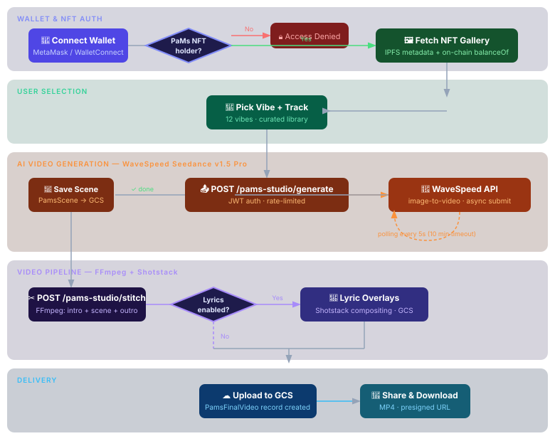

# SoniQute — PaMs Collection

The full AI pipeline for the SoniQute PaMs collection: from generative character art through LoRA model training to an NFT-gated dance video studio for social media content generation.

**Pipeline overview:**
```
Trait design → Layer artwork (Forja Studios) → Generative Art Studio → 1,000 card images
  → FLUX LoRA training (Replicate) → 25 Limited Edition characters → PaMs Dance Studio
```

---

## SoniQute Generative Studio



An AI-powered dance video generation experience built for holders of the PaMs NFT collection. Users connect their Ethereum wallet, verify NFT ownership, choose a dance vibe, and the platform generates a personalized AI dance video featuring their character — complete with music tracks and synchronized lyrics overlays.

## What it does

1. **Wallet connection + NFT gate** — users connect via MetaMask/WalletConnect; ownership of a PaMs NFT is verified on-chain before access is granted
2. **AI video generation** — dance scenes are generated using WaveSpeed's Seedance model (image-to-video), with the user's NFT character as the subject
3. **Vibe picker** — 12 dance vibes (Hype, Chill, Bounce, Fierce, Silly, Dramatic, Groovy, Robotic, Jersey Club, Afrobeats, House, …) each mapped to a tailored motion prompt
4. **Music + lyric sync** — tracks are selected from a curated library; lyrics render as styled overlays using FFmpeg compositing via the Shotstack API
5. **Scene stitching** — intro → dance scene → outro are stitched server-side into a final shareable MP4
6. **Custom character images** — admins can upload custom character images per NFT token ID, overriding the default on-chain metadata image

## Tech stack

| Layer | Tech |
|---|---|
| Frontend | Next.js 14 (App Router), TypeScript, Tailwind CSS, Framer Motion |
| Auth | JWT + NextAuth.js, Google OAuth |
| Wallet | ethers.js v5, WalletConnect / MetaMask |
| Backend | Node.js, Express.js |
| Database | MongoDB + Mongoose |
| Storage | Google Cloud Storage |
| Video generation | WaveSpeed Seedance v1.5 Pro (image-to-video) |
| Video compositing | FFmpeg + Shotstack |
| AI captioning | Google Cloud Video Intelligence |

## Architecture

```
soniqute-dance-studio/
├── frontend/               # Next.js 14 app
│   ├── app/
│   │   ├── pams-studio/    # Main dance studio page
│   │   ├── pams/           # PaMs NFT landing page
│   │   ├── auth/           # Auth callbacks
│   │   ├── login/          # Login page
│   │   └── register/       # Registration flow
│   ├── components/
│   │   ├── LyricStylePicker.tsx   # Lyric style/position picker
│   │   ├── Gate.tsx               # NFT ownership gate component
│   │   ├── ConnectWallet.tsx      # Wallet connection UI
│   │   ├── WorldScene.tsx         # 3D world background
│   │   ├── AdminPageComp/         # Content management tools
│   │   └── ...
│   └── lib/                # API clients, auth helpers, wagmi config
│
└── backend/                # Express.js API
    ├── routes/
    │   ├── pams.studio.routes.js    # Core PaMs studio endpoints
    │   ├── studio.generate.routes.js # AI video generation (WaveSpeed)
    │   ├── studio.stitch.routes.js   # Video stitching (FFmpeg)
    │   ├── studio.routes.js          # Studio profile + scene management
    │   ├── tracks.routes.js          # Music track library
    │   ├── nft.routes.js             # NFT ownership verification
    │   └── auth.routes.js            # JWT auth
    ├── models/
    │   ├── PamsScene.js       # Generated dance scene
    │   ├── PamsFinalVideo.js  # Stitched final video
    │   ├── Track.js           # Music track with clips + lyrics
    │   ├── IntroScene.js      # Intro video clips
    │   ├── OutroScene.js      # Outro video clips
    │   ├── StudioProfile.js   # User credits + generation history
    │   └── CustomCharacterImage.js  # Admin-uploaded character images
    ├── lib/
    │   ├── gcs.js             # Google Cloud Storage helpers
    │   ├── lyricStyles.js     # Lyric overlay style definitions
    │   └── characters.js      # Character metadata helpers
    └── services/
        └── videoIntelligence.service.js  # GCP Video Intelligence captions
```

## Key flows

### Dance video generation (PaMs Studio)
```
User selects NFT → picks vibe + track
  → POST /api/pams-studio/generate
    → WaveSpeed image-to-video API (async polling)
    → scene saved to PamsScene collection in GCS
  → POST /api/pams-studio/stitch
    → FFmpeg: intro + dance scene + outro
    → lyric overlays composited if enabled
    → final MP4 uploaded to GCS
    → PamsFinalVideo record created
```

### NFT gating
```
Wallet connects (ethers.js)
  → balanceOf(walletAddress) checked against PAMS_CONTRACT_ADDRESS
  → if balance > 0: tokenURI fetched for each token
    → IPFS/HTTP metadata resolved → image URL extracted
  → gallery populated; generation unlocked
```

## Local development

### Prerequisites
- Node.js 18+
- MongoDB (local or Atlas)
- Google Cloud project with GCS bucket
- WaveSpeed API key
- Shotstack API key (for lyric compositing)

### Backend

```bash
cd backend
cp .env.example .env   # fill in your values
npm install
npm run dev            # starts on :10000
```

### Frontend

```bash
cd frontend
cp .env.example .env.local   # fill in your values
npm install
npm run dev                   # starts on :3000
```

## Environment variables

See [`frontend/.env.example`](frontend/.env.example) and [`backend/.env.example`](backend/.env.example) for all required variables.

The most critical ones to get started:
- `MONGODB_URI` — MongoDB connection string
- `JWT_SECRET` — secret for signing JWTs
- `GCS_BUCKET_NAME` + `GCS_PUBLIC_BASE_URL` — where media is stored
- `WAVESPEED_API_KEY` — AI video generation
- `NEXT_PUBLIC_PAMS_CONTRACT_ADDRESS` — the deployed NFT contract on Ethereum
- `NEXT_PUBLIC_API_URL` — points frontend at the backend

---

## PaMs Generative Art Studio

The [`generator/`](generator/) subdirectory contains the custom Next.js generative art studio used to produce the original 1,000 PaMs characters, plus the scripts for generating a LoRA training dataset and submitting the training job to Replicate.

```bash
cd generator
npm install
cp -r demo-layers/* collections/pams/layers/   # use placeholder layers for demo
npm run dev                                      # studio at http://localhost:3000
```

See [`generator/README.md`](generator/README.md) for the full pipeline documentation.
